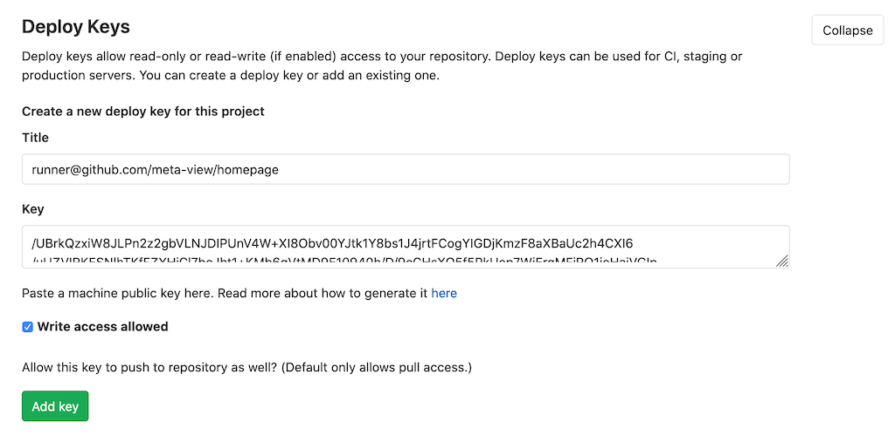

# Setup

## Client Key

```bash
ssh-keygen -f key
cat key.pub
```

Add this public as an deploy Key to your gitlab project.



```bash
cat key | base64
```

Add this as `SSH_PRIVATE_KEY` variable to your Github project secrets.

## Host Key

Create the base64 of the Repository Host Key (e.g. for git-lab.de):

```bash
ssh-keyscan git-lab.de >> githubKey
ssh-keygen -lf githubKey | base64
```

Dass this as `GITLAB_HOST_KEY` variable to your Github project secrets.


## Repository

Add the Gitlab Repository as `GITLAB_REPOSITORY` to your Github project secrets (e.g. `git@git-lab.de:meta-view/homepage.git`).

Use `SRC_BRANCH` to set your Github __source__ branch (e.g. master).  
Use `DST_BRANCH` to set your Gitlab __destination__ branch (e.g. master).


## Build Setup

```yaml
name: Push to Gitlab

on: [push]

jobs:
  build:
    runs-on: ubuntu-latest
    steps:
    - uses: actions/checkout@v1
    - name: Push to Gitlab
      uses: phaus/gitlab-push-action@master
      with:
        args: "https://gitlab.com/<namespace>/<repository>"
      env:
        GITLAB_REPOSITORY: ${{ secrets. GITLAB_REPOSITORY }}
        GITLAB_HOST_KEY: ${{ secrets.GITLAB_HOST_KEY }}
        SSH_PRIVATE_KEY: ${{ secrets.SSH_PRIVATE_KEY }}
        GITLAB_REPOSITORY: ${{ secrets.GITLAB_REPOSITORY }}
        SRC_BRANCH: ${{ secrets.SRC_BRANCH }}
        DST_BRANCH: ${{ secrets.DST_BRANCH }}
        
```